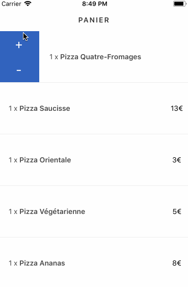

# Animation in React-Native

In this repository I demonstrate how to use the following librairies :

- [Lottie](https://github.com/airbnb/lottie-react-native)
- [Animatable](https://github.com/oblador/react-native-animatable)
- [Interactable](https://github.com/wix/react-native-interactable)
- [Animated](https://facebook.github.io/react-native/docs/animated.html)

There are five example pages. To change the displayed page, just change the `initialRouteName` in RootNavigation.js, sorry
for not implementing a full navigation :)

I made GIFs :

